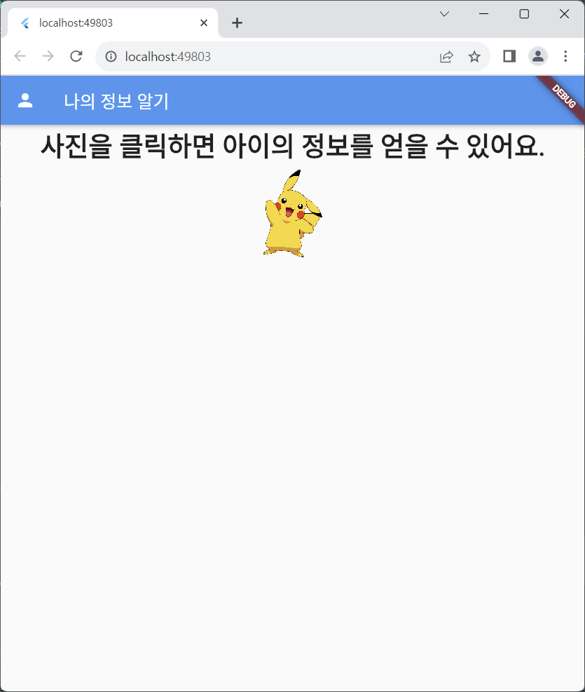

# 3주차 
## 개념 3개 이상 이용해서 간단한 프로젝트 만들기

- final 변수
- named argument 사용
- null safety 사용

캐릭터 사진을 클릭하면 변수가 포함된 Text가 출력되는 프로그램.

```dart
import 'package:flutter/material.dart';

//final 변수를 통해 변하지 않는 변수 선언.
final favoriate = '너희';

//named argument 사용 -> IconButton 부분에 적용.
void sayHello({String? name, int? age, String? country}){   //null 값을 준다고 오류가 떴었음. 초기 값을 지정할 수도 있었지만, 배운 것을 써봤음.
  print("안녕. 나는 $country에 사는 $age살 $name라고 해. 나는 $favoriate를 좋아하지 ><");
}

void main() {
  runApp(const MyApp());
}
class MyApp extends StatelessWidget {
  const MyApp({Key? key}) : super(key: key);

  @override
  Widget build(BuildContext context) {
    return MaterialApp(
      home: Scaffold(
        appBar: AppBar(
          title: Text('나의 정보 알기'),
          leading: Icon(Icons.person),
        ),
        body: Align(
          alignment: Alignment.center,
          child: Column(
            children: [
              Text('사진을 클릭하면 아이의 정보를 얻을 수 있어요.', style: TextStyle(fontSize: 30, fontWeight: FontWeight.w700,)),
              IconButton(
                icon: Image.asset(
                  'assets/피카츄2.png',
                  width: double.infinity,
                  height: double.infinity,
                  // fit: BoxFit.cover,  //사진이 잘려서 보여져서 사용하지 않음.
                ),
                color: Colors.blue,
                iconSize: 100.0,
                onPressed: () {  //onPressed에 함수를 직접 호출하는 대신 함수의 참조를 전달해야함.
                  sayHello(
                      age: 27,
                      country: '지우 어깨',
                      name: '피카츄'
                  );
                },
              ),
            ],
          ),
        ),
      ),
    );
  }
}
```

# 실행화면


